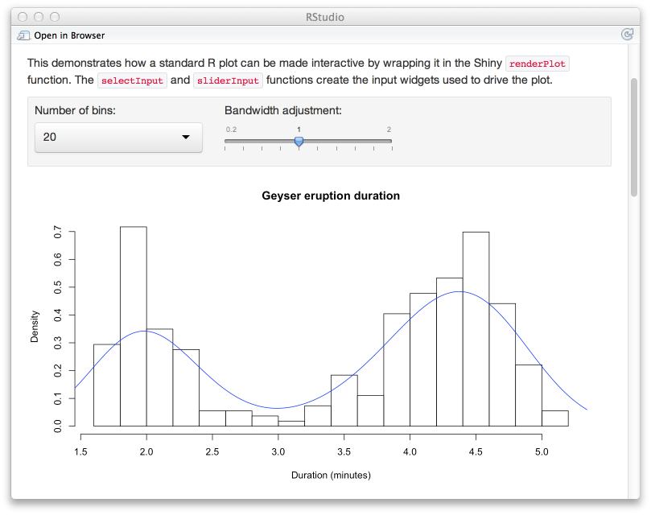
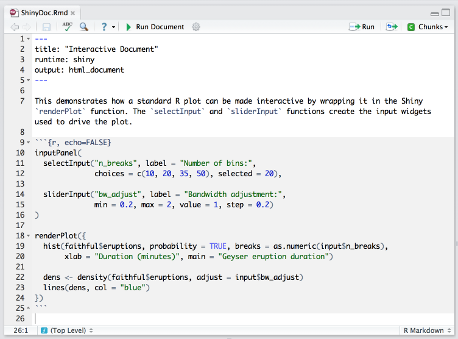
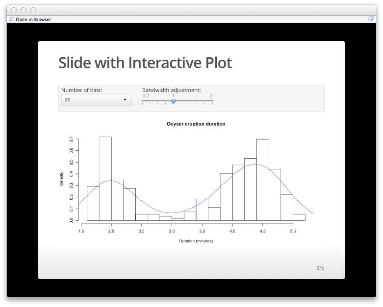
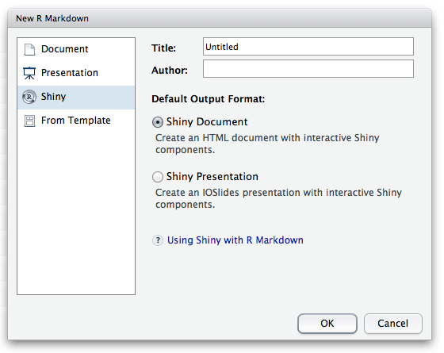
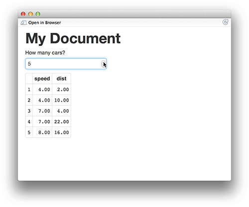
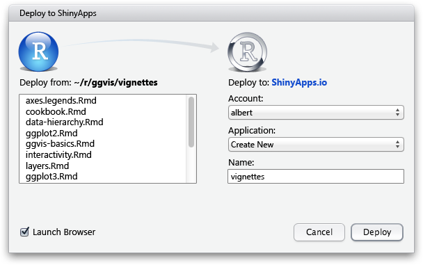

## Overview

R Markdown has been extended to support fully interactive documents. Unlike the more traditional workflow of creating static reports, you can now create documents that allow your readers to change the parameters underlying your analysis and see the results immediately.   

R Markdown leverages [Shiny](http://shiny.rstudio.com) at its core to make this possible. Here is a simple example of an R Markdown document with an interactive plot:



Note that the reader of this document is able to manipulate the number of bins and bandwidth adjustment which in turn automatically updates the plot to reflect the changes. 

Adding an interactive plot to a document is straightfoward: simply wrap the code used to generate the plot in the `renderPlot` function and define the user inputs required to make the plot dynamic. For example, here's what the code used to generate the document above looks like:



You can also embed Shiny components directly within HTML presentations:



These documents combine the expressiveness of R Markdown with the interactivity of Shiny. These documents can be run locally on the desktop or be deployed to [ShinyApps](http://shinyapps.io) or Shiny Server v1.2 (see the [Deployment] section below for more details).

## Getting Started

### Prerequisites

R Markdown interactive documents require the most recent version of RStudio (v0.98.932) so be sure to [update RStudio](http://www.rstudio.com/ide/download/preview) before trying out these features.  If you are not using RStudio then you should install the latest version of Shiny from CRAN (v0.10.0) as well as install the R Markdown package from GitHub as detailed [here](https://github.com/rstudio/rmarkdown#installation).

### Creating an Interactive Document

To create a new interactive document open the **New R Markdown** dialog in RStudio and choose to create a document with the "Shiny Document" template:



You can run a document locally using the **Run Document** command on the editor toolbar, or use the keyboard shortcut Ctrl+Shift+K (Cmd+Shift+K on Mac):


Note that this command runs the document in a separate R process, so you can continue to use the R console while the document is running. You can see any R console output from this separate process in the R Markdown console tab in RStudio. 

If you're not using RStudio, or want to run the document in-process for troubleshooting, you can also run the document from the console using the `rmarkdown::run` function.

### Inputs and Outputs

You can embed Shiny inputs and outputs in your document. Outputs are automatically updated whenever inputs change. In this example we create a `numericInput` with the name "rows" and then refer to its value via `input$rows` when generating output:

<pre class="markdown"><code>&#96;&#96;&#96;{r, echo = FALSE}
numericInput("rows", "How many cars?", 5)

renderTable({
  head(cars, input$rows)
})
&#96;&#96;&#96;
</code></pre>



In this example the output code was wrapped in a call to `renderTable`. There are many other render functions in Shiny that can be used for plots, printed R output, and more. This example uses `renderPlot` to create dynamic plot output:

<pre class="markdown"><code>&#96;&#96;&#96;{r, echo = FALSE}
sliderInput("bins", "Number of bins:", min = 1, max = 50, value = 30)

renderPlot({
  x <- faithful[, 2]  # Old Faithful Geyser data
  bins <- seq(min(x), max(x), length.out = input$bins + 1)

  # draw the histogram with the specified number of bins
  hist(x, breaks = bins, col = 'darkgray', border = 'white')
})
&#96;&#96;&#96;
</code></pre>


If you haven’t used Shiny before some of the above code will be unfamiliar to you. The [Shiny Tutorial](http://shiny.rstudio.com/tutorial) is a good place to learn more.

### Embedded Applications

The examples above illustrate adding Shiny code to an R Markdown code chunk. It's also possible to embed a full Shiny application within a document using the `shinyApp` function. 

The `shinyApp` function can be used directly or by higher level R functions that return Shiny applications. Here's an example---the [`kmeans_cluster`](https://github.com/rstudio/rmdexamples/blob/master/R/kmeans_cluster.R) function returns an interactive k-means clustering application for any dataset that is passed to it. You would use it within an R Markdown document like this:

<pre class="markdown"><code>&#96;&#96;&#96;{r, echo = FALSE}
kmeans_cluster(iris)
&#96;&#96;&#96;
</code></pre>

Which would result in the following inside the running document:


To better understand how this works check out the [source code](https://github.com/rstudio/rmdexamples/blob/master/R/kmeans_cluster.R) for the `kmeans_cluster` function. The articles on [Embedded Shiny Apps](authoring_embedded_shiny.html) and [Shiny Widgets](authoring_shiny_widgets.html) also cover using the `shinyApp` function in more depth.

## Deployment

### Shiny Server

You can deploy interactive documents using version 1.2 or later of [Shiny Server](http://www.rstudio.com/products/shiny/shiny-server/). 

Interactive documents are deployed the same way that Shiny applications are, except rather than deploying ui.R and server.R files, you deploy one or more Rmd files. You must deploy the Rmd file in a directory that does not contain a Shiny app. If there is a file named **index.Rmd** in a directory it will be served as the default document for that directory, otherwise an explicit path to the Rmd should be specified in the URL.

See the Shiny Server [documentation](http://rstudio.github.io/shiny-server/latest/#r-markdown) for more details on deploying interactive documents.

### ShinyApps

You can also publish interactive documents to the [ShinyApps](http://shinyapps.io) hosted service. To do this you should ensure that you have:

1. An account on ShinyApps (use the [signup form](http://shinyapps.io) to request an account).

2. The very latest version of the **shinyapps** R package. You can install this as follows:

```r
devtools::install_github("rstudio/shinyapps")
```

You can then deploy an interactive document the same way that you currently deploy Shiny applications. From the working directory containing the document(s) just execute:

```r
shinyapps::deployApp()
```

If you are using RStudio you can also use the **Deploy** button available when working with an interactive document:




## Learning More

This introduction just scratches the surface of the types of interactive documents you can create with R Markdown and Shiny. See the following resources to learn more:

1. [Embedded Shiny Apps](authoring_embedded_shiny.html) describes how you can embed entire Shiny applications inside an R Markdown document.

2. [Creating Shiny Widgets](authoring_shiny_widgets.html) covers creating re-usable Shiny widgets that enable others to embed interactive components in their documents with a single function call.

3. [Advanced Topics](authoring_shiny_advanced.html) includes details on converting static R Markdown documents to interactive and creating multiple-page interactive documents.

4. Finally, the [Shiny Dev Center](http://shiny.rstudio.com) includes extensive articles, tutorials, and examples to help you learn more about Shiny.


